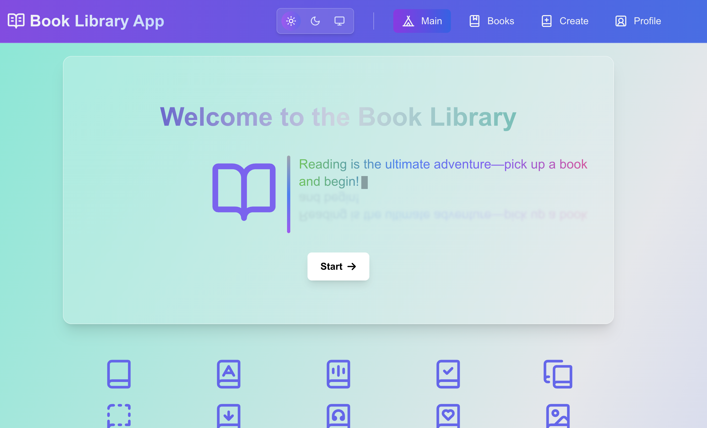
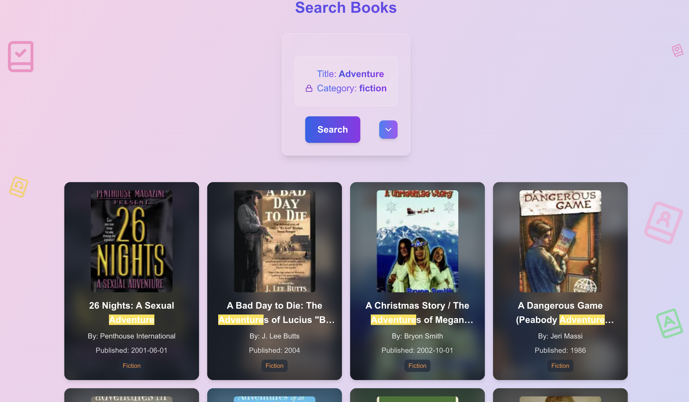
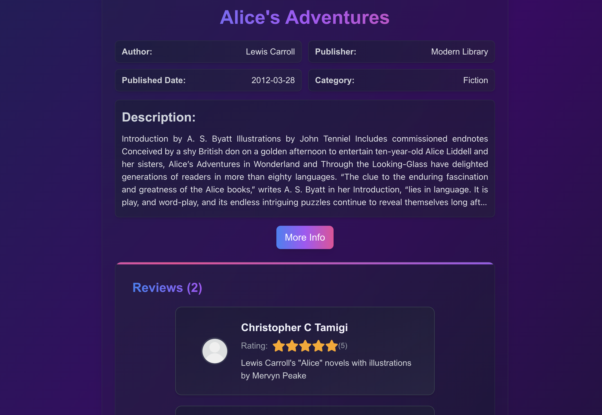
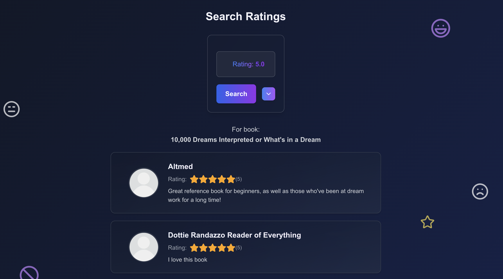

# 📚📖📙 Book Library App 📒🗞️📕

## <span>🦥 Welcome to Book Library, a ⚡️</span><span></span>, <span></span>, <span></span>, <span></span>, <span></span>, <span></span>, <span></span>, <span></span>, <span></span>, <span></span> and <span></span><span>⚡️ app.</span>

This is a stylish and modern platform for searching, filtering, creating books, and leaving reviews. Whether you're an avid reader or just starting your literary journey, this app has all the tools you need to explore and interact with your favorite books.

With **Book Library App**, you can:

- **Search for Books** 🔎: Find books based on your preferences, genres, and authors.
- **Filter Reviews** ⚖️: Easily filter reviews to find the best insights about any book.
- **Create Books** ✍️: Have a great book in mind? Add it to the library and share it with the world!
- **Leave Reviews** 💬: Share your thoughts and reviews about the books you've read and help others make informed choices.
- **Authentication** 🔒: Securely sign up, log in, and manage your activity and unlock additional functionality.

Get started today and dive into the world of books with **Book Library App**! 🚀

---

# <a name='table-of-contents'>🎞️ Table of Contents 📜</a>

### [1. 🛠️ Production Setup](#production-setup)

### [2. 🚀 Starting and Stopping the Application](#starting-and-stopping-the-application)

### [3. 📖 Using the Application](#using-the-application)

### [4. 🏗️ Project Structure](#project-structure)

### [5. 📸 Website Preview](#app-preview)

---

# <a name='production-setup'>1. Production Setup 🛠️</a>

#### Requirements

Before you begin, make sure you have the following installed on your system:

- [Node.js](https://nodejs.org/) (Latest LTS version recommended)
- [Git](https://git-scm.com/downloads) (for cloning the repository)
- [Docker](https://www.docker.com/) (for running applications)

#

Follow the steps below to install and run the application in **production mode** using Docker and Node.js:

#### 1. Clone the Repository

Clone the project to your machine:

```bash
git clone https://github.com/KonstPartner/Book-Library.git
```

#### 2. Navigate to the Project Folder

Go to the project directory:

```sh
cd Book-Library/
```

#### 3. Environment Configuration for Backend

1. Create a `.env` file in the root of the `Book-Library` folder _(or replace it if it already exists)_.
2. Fill the `.env` file based on `.env.sample` in the `Book-Library` folder or use the default values:

```env
POSTGRES_USER=admin
POSTGRES_PASSWORD=admin_password
POSTGRES_DB=db

REDIS_PASSWORD=redis_password

PORT=4000
JWT_SECRET=588e747c703e4305eb33f7839df8fb1406eef28088a3a034921b9ebc7dba3c1e
```

#### 4. Build and Start Docker Containers

Build and run the required containers in the background:

```bash
docker compose up -d --build
```

After running this command, the following containers will be started:

- **API service** (Book Library backend)
- **PostgreSQL** (Database container)
- **Redis** (Cache storage)
- **Adminer** (Database management interface)
- **RedisInsight** (Redis management tool)

#### 5. Import Database Data

1. Download the database backup file [book-library_pg_data.tar.gz](https://drive.google.com/file/d/1E0hW3a8vFNCz5_L1WRdxfFKWxFfLUo3m/view?usp=sharing).
2. Stop running containers before importing the database:

```sh
docker compose stop
```

3. Open **Docker Desktop**, go to the **Volumes** tab, locate the newly created **book-library_pg_data** volume and click on it.
4. Click **Import** and select the downloaded database file **book-library_pg_data.tar.gz**.
5. Click **Import** and wait for the process to **complete**.

#### 6. Start Docker Containers Again

After importing the database, restart the containers:

```bash
docker compose up -d
```

#### 7. Navigate to the Client Folder

Go to the client directory:

```sh
cd ./client
```

#### 8. Environment Variables for Frontend

1. Create a `.env.local` file in the root of the `client` folder _(or replace it if it already exists)_.
1. Fill it with the required environment variables based on `.env.local.sample` or use the default values:

```env
NEXT_PUBLIC_API_BASE_URL=http://localhost:4000
```

#### 9. Build the Client Application

1. Install dependencies, and build the production frontend:

```bash
npm install

npm run build
```

2. Optionally, reinstall only production dependencies _(to reduce the size of node_modules for production runtime)_:

```bash
npm install --omit=dev
```

#### 10. Start the Client Application

Start the frontend:

```bash
npm start
```

This will start the **Book Library Web Application** and serve it on `http://localhost:3000`.

#

⤴️ [_`Back to Table of Content`_](#table-of-contents)

---

# <a name='starting-and-stopping-the-application'>2. Starting and Stopping the Application 🚀</a>

Once the application is installed, you can start or stop it using the following steps.

## ▶️ Starting the Application

Follow these steps to run the application after installation:

1. Start the Backend Services  
   Navigate to the root project directory `Book-Library` and run the following command:

```bash
docker compose up -d
```

After this, the following containers will be started:

- **API service** (Book Library backend) on `http://localhost:4000` by default
- **PostgreSQL** (Database container)
- **Redis** (Cache storage)
- **Adminer** (Database management interface) on `http://localhost:8080`
- **RedisInsight** (Redis management tool) on `http://localhost:5540`

2. Start the Client Application  
   Navigate to the client folder and start the frontend:

```bash
cd client/
npm start
```

This will start the **Book Library Web Application** and serve it on `http://localhost:3000`.

---

## ⏹️ Stopping the Application

To stop the running application, follow these steps:

1. Stop the Client Application  
   In the terminal you started client (_npm start_), press the following key combination to stop it:

- `Ctrl + C`

2. Stop Backend Services  
   Navigate back to the project root and stop the running containers:

```bash
cd ..
docker compose stop
```

This will stop all running containers while preserving data. To completely remove the containers, use:

```bash
docker compose down
```

#

⤴️ [_`Back to Table of Content`_](#table-of-contents)

---

# <a name='using-the-application'>3. Using the Application 📖</a>

Once the **Book Library App** is up and running, you can use the web application, interact with the API service, and access the database and caching services.

### 🌐 Using the Web Application

To use the web application, open a browser and go to the link displayed when the application starts. By default, it runs at:

```
http://localhost:3000
```

This will open the **Book Library Web Application**, where you can browse books, add new ones, rate them, and manage categories.

#

### 🔌 Using the API Service

The API service runs on the port specified in the `.env` file or defaults to **4000**.
By default, it runs at:

```
http://localhost:4000
```

You can send HTTP requests to the following endpoints:

#### 📚 Books

- `GET /books` – Retrieve all books
- `POST /books` – Add a new book

#### 📖 Single Book

- `GET /book/:id` – Retrieve a book by ID
- `POST /book/:id` – Add data to a specific book
- `DELETE /book/:id` – Delete a book
- `PATCH /book/:id` – Update book details

#### ⭐ Book Ratings

- `GET /book/:id/ratings` – Retrieve ratings for a book
- `POST /book/:id/ratings` – Add a rating to a book

#### 🔀 Random Books

- `GET /books/random` – Retrieve a random set of books

#### 📂 Categories

- `GET /categories` – Retrieve all categories
- `POST /categories` – Add a new category

#### 📂 Single Category

- `GET /categories/:id` – Retrieve a category by ID
- `POST /categories/:id` – Add data to a category
- `DELETE /categories/:id` – Delete a category
- `PATCH /categories/:id` – Update category details

#### ⭐ Ratings

- `GET /ratings` – Retrieve all ratings
- `POST /ratings` – Add a new rating

#### ⭐ Single Rating

- `GET /ratings/:id` – Retrieve a rating by ID
- `POST /ratings/:id` – Add data to a rating
- `DELETE /ratings/:id` – Delete a rating
- `PATCH /ratings/:id` – Update rating details

#### 👤 Users

- `GET /users` – Retrieve all users
- `POST /users` – Add a new user

#### 👤 Single User

- `GET /users/:id` – Retrieve a user by ID
- `POST /users/:id` – Add data to a user
- `DELETE /users/:id` – Delete a user
- `PATCH /users/:id` – Update user details

#### ⭐ User Ratings

- `GET /users/:id/ratings` – Retrieve ratings given by a user
- `POST /users/:id/ratings` – Add a rating as a user

#### 🔐 Authentication

- `POST /users/register` – Register a new user
- `POST /users/login` – Log in and receive a token
- `GET /users/profile` – Retrieve the logged-in user's profile

#

### 🗄️ Using Adminer

Adminer is a web-based database management tool that allows direct interaction with the PostgreSQL database.

1. Open **Adminer** in a browser:

   ```
   http://localhost:8080
   ```

2. In the login interface, enter the following credentials:

   - **System:** `PostgreSQL`
   - **Server:** `postgres`
   - **Username:** (use the value from `.env` (_by default_ `POSTGRES_USER=admin`))
   - **Password:** (use the value from `.env` (_by default_ `POSTGRES_PASSWORD=admin_password`))
   - **Database:** `db`

3. Click **Login** to access the database.

#

### 🔴 Using RedisInsight

RedisInsight is a GUI tool for managing Redis databases.

1. Open **RedisInsight** in a browser:

   ```
   http://localhost:5540
   ```

2. Accept the **EULA and Privacy Settings**.

3. Click **+ Add Redis Database**.

4. In the **Connection Settings** window, enter the following:

   - **Host:** `redis`
   - **Port:** `6379`
   - **Password:** (use the value from `.env` (_by default_ `REDIS_PASSWORD=redis_password`))

5. Click **Add Redis Database**.

6. Select the newly added database to view and manage Redis data.

#

⤴️ [_`Back to Table of Content`_](#table-of-contents)

---

# <a name='project-structure'>4. Project Structure 🏗️</a>

Below is the project structure with a brief explanation of each file and folder:

### Server Directory:

```
server/
├── migrations/                         # Database migration files
│   ├── 20250315110805-add-user-id-to-books.cjs  # Migration: Adds user_id to books table
│
├── config/                             # Configuration files
│   ├── config.cjs                      # Main project settings
│
├── src/                                # Source code
│   ├── app.ts                          # Express application initialization
│   ├── server.ts                       # Server startup
│   ├── types.ts                        # TypeScript type definitions
│   │
│   ├── config/                         # Configuration files
│   │   ├── config.ts                    # General settings
│   │   ├── database.ts                   # PostgreSQL database configuration
│   │   ├── redis.ts                      # Redis configuration
│   │
│   ├── middleware/                      # Middleware functions
│   │   ├── authMiddleware.ts             # Authentication middleware
│   │   ├── validationErrorHandler.ts     # Validation error handler
│   │   ├── validators/                   # Helper validators
│   │   │   ├── validators.ts
│   │   │   ├── validationRules.ts
│   │
│   ├── seed/                            # Scripts for importing data into the database
│   │   ├── import/
│   │   │   ├── startImport.ts            # Entry point for data import
│   │   │   ├── config.ts                 # Import settings
│   │   │   ├── logs/logger.ts            # Import process logging
│   │   │   ├── utils/                     # Helper functions for import
│   │   │   │   ├── validateRow.ts
│   │   │   │   ├── checkRow.ts
│   │   │   │   ├── cutBracketsAndQuotes.ts
│   │   │   │   ├── validateUser.ts
│   │   │   ├── operations/                # Database operations for import
│   │   │   │   ├── importData.ts
│   │   │   │   ├── importTables.ts
│   │   │   │   ├── addDataToDB.ts
│   │
│   ├── models/                          # Database models
│   │   ├── Book.ts                        # Book model
│   │   ├── Category.ts                    # Category model
│   │   ├── Rating.ts                      # Rating model
│   │   ├── User.ts                        # User model
│   │   ├── RegisteredUser.ts              # Registered user model
│   │   ├── modelsInterfaces.ts            # Interfaces for models
│   │   ├── modelsAssociations.ts          # Model relationships
│   │
│   ├── controllers/                      # Controllers for API requests
│   │   ├── bookController.ts              # Logic for book operations
│   │   ├── categoryController.ts          # Logic for category operations
│   │   ├── ratingController.ts            # Logic for rating operations
│   │   ├── userController.ts              # Logic for user operations
│   │   ├── authController.ts              # Authentication and registration
│   │
│   ├── routes/                           # API route definitions
│   │   ├── bookRouter.ts                  # Routes for books
│   │   ├── categoryRouter.ts              # Routes for categories
│   │   ├── ratingRouter.ts                # Routes for ratings
│   │   ├── userRouter.ts                  # Routes for users
│   │
│   ├── services/                         # Business logic and data handling
│   │   ├── booksServices.ts               # Services for books
│   │   ├── categoriesServices.ts          # Services for categories
│   │   ├── ratingsServices.ts             # Services for ratings
│   │   ├── usersServices.ts               # Services for users
│   │   ├── authServices.ts                # Authentication and JWT handling
│   │   ├── servicesUtils.ts               # Utility functions for services
│   │
│   ├── utils/                            # Helper utilities
│   │   ├── updateRedisCache.ts            # Redis cache update function
│   │   ├── validationHelpers.ts           # Validation helper functions
│   │   ├── handleResponse.ts              # API response formatting
│   │   ├── generateJWT.ts                 # JWT token generation
│   │   ├── simplifyWhereOptions.ts        # SQL query processing
│   │   ├── getRequestQueries.ts           # Extracting query parameters
│   │   ├── transformModel.ts              # Transforming models to JSON
│
├── Dockerfile                           # Docker image build file
├── docker-compose.yml                    # Docker Compose configuration
├── README.md                             # Project documentation
├── .env.sample                           # Sample environment variables file
├── .env                                  # Environment variables file (not included in Git)
├── .gitignore                            # Files ignored by Git
├── .dockerignore                         # Files ignored in Docker builds
├── .eslintignore                         # Files ignored by ESLint
├── .eslintrc.json                        # ESLint configuration
├── package.json                          # Dependencies and npm scripts
├── package-lock.json                     # Dependency versions lock file
├── tsconfig.json                         # TypeScript configuration
└── nodemon.json                          # Nodemon configuration for development
```

#

### Client Directory:

```
client/
├── types/                              # TypeScript type definitions
│   ├── ErrorType.ts                    # Error types
│   ├── CategoryType.ts                 # Category type
│   ├── BookType.ts                     # Book type
│   ├── FieldsType.ts                   # Fields for forms
│   ├── FetchDataTypes.ts               # Types for fetched data
│   ├── NavLinksType.ts                 # Navigation links types
│   ├── MetadataType.ts                 # Metadata type
│   ├── RatingType.ts                   # Rating type
│   ├── ThemeType.ts                    # Theme type
│   ├── ReduxTypes.ts                   # Redux state types
│   ├── SearchFieldsType.ts             # Types for search fields
│   ├── SortOptionsType.ts              # Sort options type
│   ├── UserType.ts                     # User type
│   ├── ContextType.ts                  # Context types
│
├── .env.local.sample                   # Sample local environment file
├── .env.local                          # Local environment file (ignored by Git)
├── .DS_Store                            # macOS metadata file (ignored by Git)
│
├── app/                                # Main app components
│   ├── favicon.ico                     # App favicon
│   ├── ratings/                        # Ratings-related pages
│   │   ├── [id]/                       # Rating page for specific ID
│   │   │   ├── page.tsx                # Rating page content
│   ├── books/                          # Books-related pages
│   │   ├── [id]/                       # Book page for specific ID
│   │   │   ├── ratings/                # Ratings for a specific book
│   │   │   │   ├── page.tsx            # Book ratings page
│   │   │   ├── page.tsx                # Book details page
│   │   ├── create/                     # Create new book page
│   │   │   ├── page.tsx                # Page to create new book
│   ├── layout.tsx                      # Main layout for the app
│   ├── users/                          # User-related pages
│   │   ├── profile/                    # Profile-related pages
│   │   │   ├── page.tsx                # User profile page
│   │   ├── [id]/                       # User page for specific ID
│   │   │   ├── ratings/                # Ratings for a specific user
│   │   │   │   ├── page.tsx            # User's ratings page
│   │   │   ├── page.tsx                # User details page
│   ├── page.tsx                        # Main page
│   ├── globals.css                     # Global styles
│
├── postcss.config.mjs                  # PostCSS configuration
├── constants/                          # Constants for the app
│   ├── apiSources.ts                   # API source configurations
│   ├── defaultFetchData.ts             # Default data fetching settings
│   ├── images.ts                       # Image paths and constants
│   ├── sortOrder.ts                    # Sorting order options
│   ├── cardsLimit.ts                   # Card display limit
│   ├── createFields.ts                 # Fields for creating data
│   ├── searchFields.ts                 # Search field settings
│
├── tests/                              # Unit and integration tests
│   ├── createSearchFromParams.test.ts  # Test for search parameter creation
│   ├── createSearchQueryString.test.ts # Test for creating search query string
│   ├── fetchDataWrapper.test.ts        # Test for data fetching wrapper
│   ├── getSearchQueries.test.ts        # Test for search queries
│   ├── fetchData.test.ts               # Test for data fetching
│   ├── validateData.test.ts            # Test for data validation
│   ├── validateSearch.test.ts          # Test for search validation
│   ├── isValidData.test.ts             # Test for data validity check
│
├── utils/                              # Utility functions
│   ├── validateData.ts                 # Data validation functions
│   ├── validateSearch.ts               # Search validation functions
│   ├── createSearchFromParams.ts       # Creating search query params
│   ├── getPrettyField.ts               # Get human-readable field names
│   ├── getRatingValues.ts              # Get rating values for books
│   ├── updateSearchParams.ts           # Update search parameters
│   ├── fetchData.ts                    # Data fetching functions
│   ├── getSearchQueries.ts             # Get search query data
│   ├── getBookValues.ts                # Extract book values for UI
│   ├── createSearchQueryString.ts      # Generate search query string
│   ├── fetchProfile.ts                 # Fetch user profile data
│   ├── isValidData.ts                  # Check if data is valid
│   ├── fetchDataWrapper.ts             # Wrapper for fetching data
│
├── next-env.d.ts                       # Next.js environment types (ignored by Git)
├── README.md                           # Project documentation
├── tailwind.config.ts                  # Tailwind CSS configuration
│
├── components/                         # Reusable UI components
│   ├── StoreProvider.tsx               # Redux store provider
│   ├── RatingsIcons.tsx                # Rating icon components
│   ├── auth/                           # Authentication-related components
│   │   ├── LogInForm.tsx               # Login form
│   │   ├── AuthModal.tsx               # Authentication modal
│   │   ├── SignUpForm.tsx              # Signup form
│   ├── PaginationBar.tsx               # Pagination UI
│   ├── BooksGridIcons.tsx              # Book grid icon components
│   ├── ratings/                        # Rating-related UI components
│   │   ├── RatingInfo.tsx              # Detailed rating info
│   │   ├── RatingCard.tsx              # Rating card UI
│   │   ├── SingleRating.tsx            # Single rating UI
│   │   ├── RatingStars.tsx             # Rating stars UI
│   │   ├── RatingInput.tsx             # Rating input UI
│   │   ├── SearchRatingsList.tsx       # Ratings list for search results
│   ├── books/                          # Book-related UI components
│   │   ├── RandomBooksList.tsx         # List of random books
│   │   ├── BooksList.tsx               # Books list UI
│   │   ├── MainScreen.tsx              # Main screen UI
│   │   ├── SearchBooksScreen.tsx       # Search books UI
│   │   ├── StartBtn.tsx                # Start button component
│   │   ├── BookInfo.tsx                # Book detailed info
│   │   ├── BookCard.tsx                # Book card UI
│   ├── navigationBar/                  # Navigation bar components
│   │   ├── Navbar.tsx                  # Navbar component
│   │   ├── NavLinks.tsx                # Navigation links
│   │   ├── ToggleTheme.tsx             # Theme toggle button
│   ├── HighlightText.tsx               # Text highlighting UI
│   ├── search/                          # Search-related components
│   │   ├── Search.tsx                  # Search bar UI
│   │   ├── SortMenu.tsx                # Sort options menu
│   ├── users/                          # User-related components
│   │   ├── profile/                    # Profile components
│   │   │   ├── ProfileScreen.tsx       # User profile UI
│   │   │   ├── ChangePasswordForm.tsx  # Change password form
│   │   ├── user/                       # User info components
│   │   │   ├── SingleUser.tsx          # Single user profile
│   │   │   ├── UserInfo.tsx            # User info UI
│   ├── dataOptions/                    # Data options components (e.g., delete, update)
│   ├── RefreshBtn.tsx                  # Refresh button
│   ├── Button.tsx                      # General button component
│   ├── Modal.tsx                       # Modal UI component
│   ├── create/                         # Create data-related components
│   │   ├── CreateBookInput.tsx         # Create book form input
│   │   ├── CreateBook.tsx              # Create new book form
│   ├── Spinner.tsx                     # Loading spinner
│   ├── RippleEffect.tsx                # Ripple effect for buttons
│   ├── Input.tsx                       # Input field component
│   ├── BooksIcons.tsx                  # Book icon components
│
├── public/                             # Public assets
│   ├── file.svg                        # File SVG
│   ├── vercel.svg                      # Vercel logo
│   ├── next.svg                        # Next.js logo
│   ├── globe.svg                       # Globe icon
│   ├── window.svg                      # Window icon
│
├── jest.setup.ts                       # Jest setup configuration
├── .gitignore                          # Git ignore file
├── package-lock.json                   # NPM lock file
├── package.json                        # NPM dependencies and scripts
├── hooks/                              # Custom React hooks
│   ├── useSearchWithPagination.ts      # Custom hook for search with pagination
│   ├── useDataActions.ts               # Custom hook for data actions
│   ├── useAuth.ts                      # Custom hook for authentication
├── tsconfig.json                       # TypeScript configuration
├── data/                               # Static data
│   ├── encouragePhrases.json           # Encouragement phrases
├── assets/                             # Static assets
│   ├── images/                         # Image assets
│   │   ├── cover-image.png             # Cover image
│   │   ├── user-avatar.png             # User avatar
├── redux/                              # Redux store and slices
│   ├── slices/                         # Redux slices
│   │   ├── authSlice.ts                # Authentication slice
│   ├── store.ts                        # Redux store configuration
├── eslint.config.mjs                   # ESLint configuration
├── next.config.ts                      # Next.js configuration
├── jest.config.ts                      # Jest configuration
```

#

⤴️ [_`Back to Table of Content`_](#table-of-contents)

---

# <a name='app-preview'>5. App Preview 📸</a>

Here’s a sneak peek at what **Book Library App** looks like in action!



#



#



#


#



#

⤴️ [_`Back to Table of Content`_](#table-of-contents)

---

# 👨‍💻 Thank You for Using Book Library App!

If you enjoy using this application, I’d greatly appreciate it if you could ⭐️ **star this repository** on GitHub.

Happy reading! 📚
